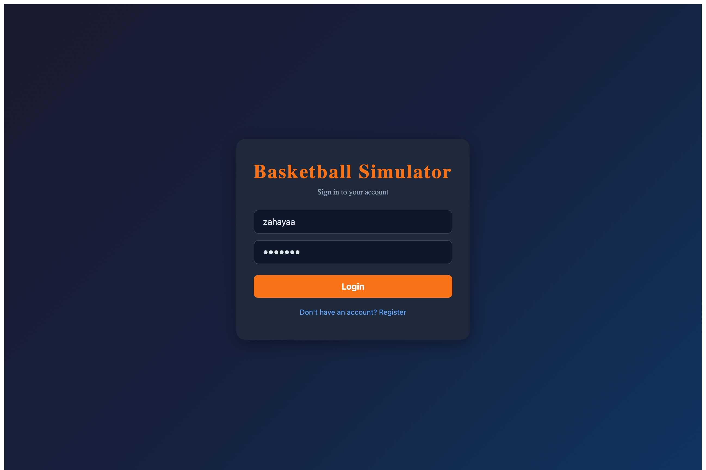
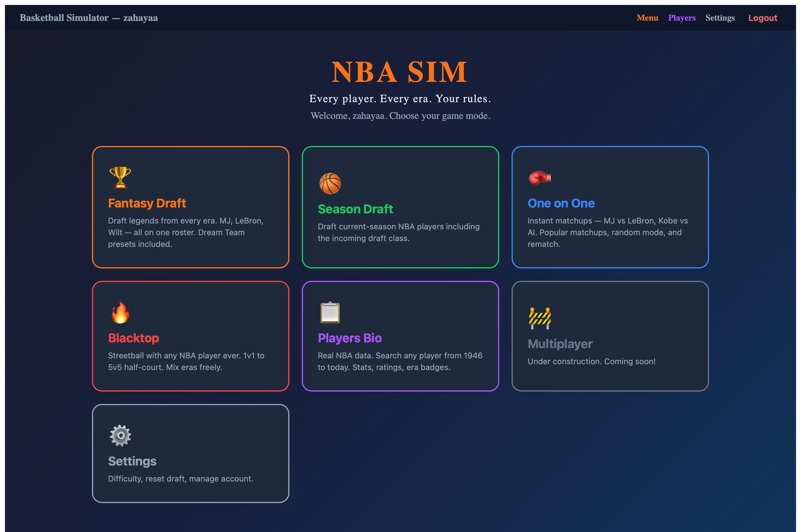
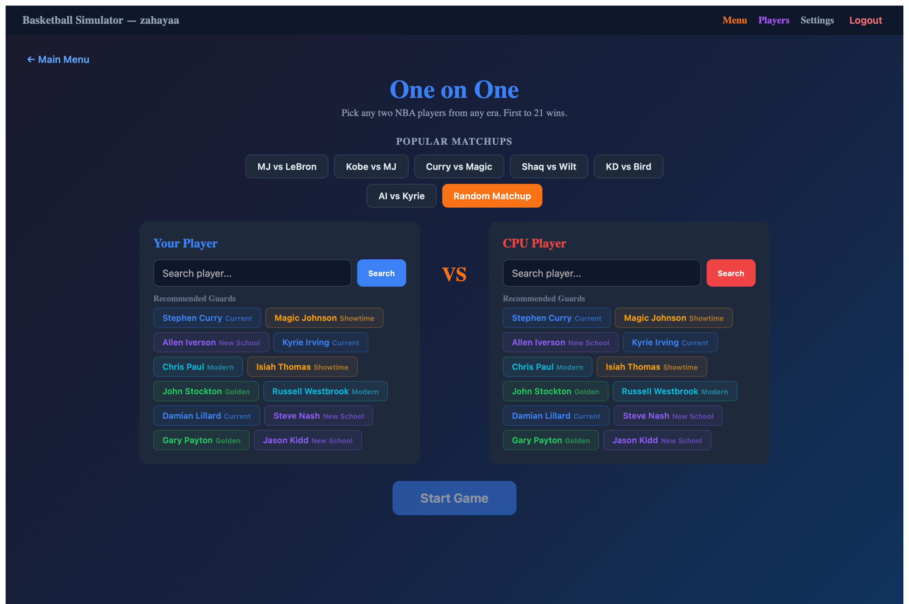
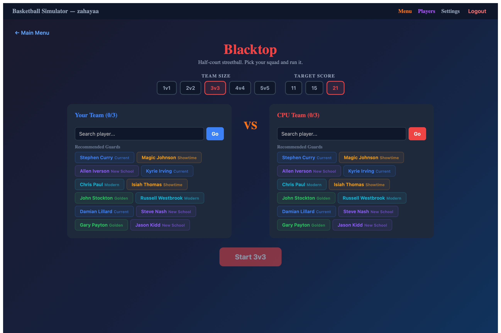
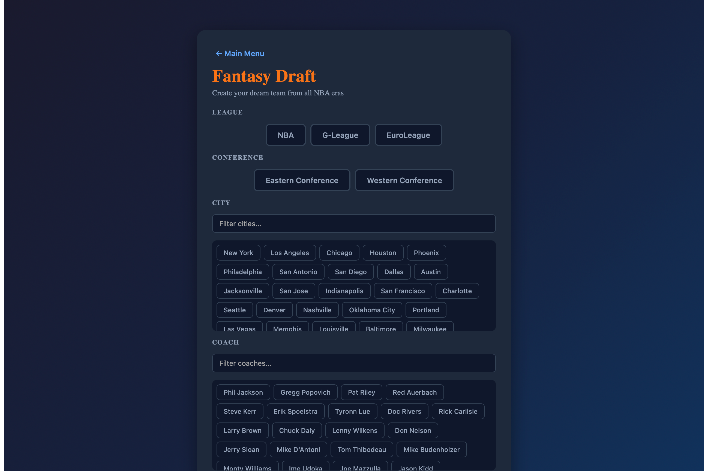

# 🏀 Basketball Simulator

A full-stack NBA basketball simulator with multiple game modes, built with the MERN stack (MongoDB, Express, React, Node.js). Draft real NBA players from any era, build your roster, and compete in full 5v5 games, 1v1 battles, or streetball on the blacktop.

## 🎮 Game Modes

- **🏆 Fantasy Draft** – Draft players from all NBA eras. Pick your city, coach, conference, and build your dream team of up to 12 players. Compete against CPU-generated opponents in full simulated games.
- **📅 Season Draft** – Draft from current-season NBA rosters for the 2025-26 season with active coaches.
- **⚡ One on One** – Pick any two NBA players and run a 1v1 game to 21 with full play-by-play.
- **🔥 Blacktop** – Streetball mode. Choose 1v1 up to 5v5, set a target score (11, 15, or 21), and play half-court.
- **📊 Players Bio** – Search any NBA player (active or retired) and view their full profile, stats, and ratings.
- **🌐 Multiplayer** – Online head-to-head (coming soon).
- **⚙️ Settings** – Difficulty levels (Easy, Hard, Pro, All-Star, Legacy), reset game data, manage account.

## 🌐 Core Features

- 🔐 **JWT Authentication** – Secure register/login with rate limiting
- 🧠 **Player Ratings** – Heuristic ratings based on draft position and experience
- 🎮 **Game Simulation** – Full 4-quarter + overtime engine with weighted scoring, rebounds, assists, turnovers
- 📺 **Animated GameCast** – Live play-by-play with scoreboard and speed controls (Slow/Normal/Fast/Turbo)
- 🔍 **Player Search** – Search any NBA player across all eras via the balldontlie API
- 💾 **Persistent Progress** – Wins, losses, teams, and settings stored in MongoDB

## 🚀 Tech Stack

- **Frontend:** React 18, React Router 6, Context API
- **Backend:** Node.js, Express 5, Mongoose, JWT, bcryptjs
- **Database:** MongoDB
- **API:** NBA data via [balldontlie.io](https://www.balldontlie.io/)

## 📁 Project Structure

```
project-root/
├── client/                     # React frontend
│   ├── src/
│   │   ├── context/            # AuthContext
│   │   ├── pages/              # MainMenu, DraftPage, SeasonDraftPage,
│   │   │                       # GamePage, OneOnOnePage, BlacktopPage,
│   │   │                       # PlayerBioPage, SettingsPage, MultiplayerPage
│   │   └── components/         # GameCast
│   └── public/
├── server/                     # Express backend
│   ├── models/                 # User, Game schemas
│   ├── routes/                 # auth, draft, nba, simulate, games, settings
│   ├── services/               # playerRating, simulation (5v5, 1v1, blacktop)
│   └── middleware/             # JWT auth middleware
└── README.md
```

## ⚙️ Local Setup

### 1. Clone & Install

```bash
git clone https://github.com/zahyaa/NBASIM_Project_Full.git
cd NBASIM_Project_Full
cd server && npm install && cd ..
cd client && npm install && cd ..
```

### 2. Start MongoDB

```bash
brew services start mongodb/brew/mongodb-community
```

### 3. Configure Environment

Create `server/.env`:

```env
JWT_SECRET=your_secret_key_here
BALLDONTLIE_API_KEY=your_api_key_here
MONGODB_URI=mongodb://localhost:27017/nbasim
PORT=5001
```

Get a free API key at [app.balldontlie.io](https://app.balldontlie.io/).

### 4. Start Backend

```bash
cd server && node server.js
```

Server runs on [http://localhost:5001](http://localhost:5001)

### 5. Start Frontend

```bash
cd client && NODE_OPTIONS=--openssl-legacy-provider npm start
```

Visit [http://localhost:3000](http://localhost:3000)

---

## 🧪 API Endpoints

### Auth
| Method | Route | Description |
|--------|-------|-------------|
| POST | `/api/auth/register` | Create account |
| POST | `/api/auth/login` | Login |
| GET | `/api/auth/me` | Get current user (protected) |

### Draft
| Method | Route | Description |
|--------|-------|-------------|
| POST | `/api/draft/setup` | Save conference, league, city, coach, draft type |
| GET | `/api/draft/pool` | Get available players by conference/season |
| POST | `/api/draft/pick` | Draft a player |
| POST | `/api/draft/complete` | Finalize draft with team name |

### NBA Data
| Method | Route | Description |
|--------|-------|-------------|
| GET | `/api/nba/teams` | All NBA teams |
| GET | `/api/nba/players/search?q=` | Search players by name |
| GET | `/api/nba/players/:id/bio` | Full player profile + season averages |
| GET | `/api/nba/roster` | Team roster with ratings |

### Simulation
| Method | Route | Description |
|--------|-------|-------------|
| POST | `/api/simulate` | Full 5v5 game simulation |
| POST | `/api/simulate/1v1` | 1v1 to target score |
| POST | `/api/simulate/blacktop` | Blacktop (1-5 per team) |

### Settings
| Method | Route | Description |
|--------|-------|-------------|
| GET | `/api/settings` | Get user settings |
| PATCH | `/api/settings` | Update difficulty/season |
| POST | `/api/settings/reset` | Reset all game data |
| DELETE | `/api/settings/account` | Delete account |

### Games
| Method | Route | Description |
|--------|-------|-------------|
| GET | `/api/games` | Saved game history |
| POST | `/api/games/save` | Save a game result |

---

## 📝 Notes

- Port 5001 is used instead of 5000 (macOS AirPlay Receiver occupies 5000)
- `NODE_OPTIONS=--openssl-legacy-provider` is required for react-scripts 3.x on Node 17+
- Free balldontlie API tier supports Teams, Players, and Games; Season Averages require a paid plan

---

## 📸 Screenshots











---

## 📄 License

MIT License

---

Built with ❤️ by [@zahyaa](https://github.com/zahyaa)
