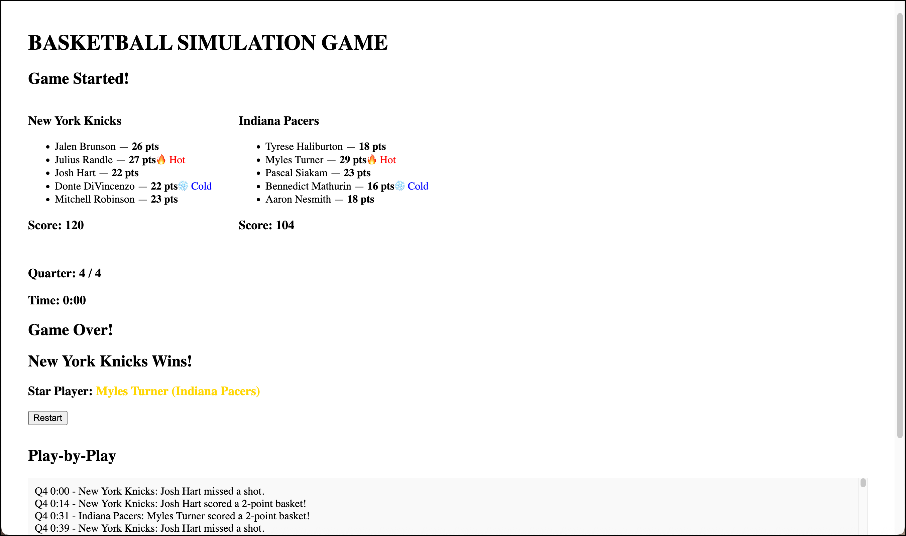
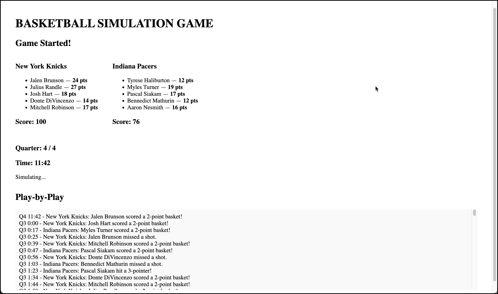

# 🏀 Basketball Simulator

A full-stack basketball game simulator built with the MERN stack (MongoDB, Express, React, Node.js). Draft real NBA players, build your roster, and simulate games with an animated play-by-play gamecast.

## 🌐 Features

- 🔐 **User Authentication** – Register/login with JWT-based auth
- 🏟️ **Conference & League Selection** – Choose Eastern or Western Conference and league before drafting
- 📋 **Fantasy Draft** – Draft up to 12 real NBA players from the balldontlie API
- 🧠 **Player Ratings** – Heuristic ratings based on draft position and experience (stats-based on paid API tiers)
- 🎮 **Game Simulation** – Full 4-quarter + overtime engine with weighted scoring, rebounds, assists, turnovers
- 📺 **Animated GameCast** – Live play-by-play with scoreboard, speed controls (Slow/Normal/Fast/Turbo), and auto-scroll
- 🔄 **Fresh Start on Login** – Roster resets each session so you can re-draft and play again
- 💾 **Save Progress** – Wins, losses, and game history stored in MongoDB

## 🚀 Tech Stack

- **Frontend:** React 18, React Router 6, Context API
- **Backend:** Node.js, Express, Mongoose, JWT, bcryptjs
- **Database:** MongoDB
- **API:** NBA data via [balldontlie.io](https://www.balldontlie.io/) (free tier supported)

## 📁 Project Structure

```
project-root/
├── client/                 # React frontend
│   ├── src/
│   │   ├── context/        # AuthContext (auth state)
│   │   ├── pages/          # LoginPage, DraftPage, GamePage
│   │   └── components/     # GameCast, Controls, etc.
│   └── public/
├── server/                 # Express backend
│   ├── models/             # User, Game schemas
│   ├── routes/             # auth, draft, nba, simulate, games
│   ├── services/           # playerRating, simulation engine
│   ├── middleware/          # JWT auth middleware
│   └── .env.example        # Environment variable template
└── README.md
```

## ⚙️ Local Setup

### 1. Clone the Repo

```bash
git clone https://github.com/zahyaa/NBASIM_Project_Full.git
cd NBASIM_Project_Full
```

### 2. Start MongoDB

```bash
brew services start mongodb/brew/mongodb-community
```

### 3. Configure Environment

```bash
cp server/.env.example server/.env
```

Edit `server/.env` with your values:
- `MONGODB_URI` – MongoDB connection string
- `JWT_SECRET` – Any secret string for token signing
- `BALLDONTLIE_API_KEY` – Free API key from [app.balldontlie.io](https://app.balldontlie.io/)

### 4. Start Backend

```bash
cd server
npm install
node server.js
```

Server runs on [http://localhost:5001](http://localhost:5001)

### 5. Start Frontend

```bash
cd client
npm install
NODE_OPTIONS=--openssl-legacy-provider npm start
```

Visit [http://localhost:3000](http://localhost:3000)

---

## 🧪 API Endpoints

### Auth
- `POST /api/auth/register` – Create account
- `POST /api/auth/login` – Login (resets roster)
- `GET /api/auth/me` – Get current user (protected)

### Draft
- `POST /api/draft/setup` – Save conference & league selection
- `GET /api/draft/pool` – Get available players (filtered by conference)
- `POST /api/draft/pick` – Draft a player
- `POST /api/draft/complete` – Finish draft early

### NBA Data
- `GET /api/nba/teams` – All NBA teams
- `GET /api/nba/players` – Player search
- `GET /api/nba/roster` – Team roster with ratings

### Game
- `POST /api/simulate` – Simulate a game
- `GET /api/games` – Saved game history
- `POST /api/games/save` – Save a game result

---

## 📝 Notes

- Port 5001 is used instead of 5000 (macOS AirPlay Receiver occupies 5000)
- `NODE_OPTIONS=--openssl-legacy-provider` is required for react-scripts 3.x on Node 18+
- Free balldontlie API tier supports Teams, Players, and Games; Season Averages require a paid plan
#-----------------------------------------------------------------------------

# Basketball Simulation Game

## Overview

This project simulates an NBA basketball game between two user-selected teams. Users pick 5 players from each team, and the game automatically simulates quarter-by-quarter (including overtime if needed), generates play-by-play commentary, box scores, and highlights hot/cold/star players.

---

## Major Changes

### 1. Team and Player Selection
- All 30 NBA teams are available.
- Each team has at least 12 players to choose from.
- Users select 5 players per team for the starting lineup.

### 2. Game Simulation
- The game simulates 4 quarters (12 minutes each).
- If the score is tied after 4 quarters, 5-minute overtime periods are automatically played until there is a winner.
- The simulation runs automatically—no need to click for each play.

### 3. Play-by-Play and Box Score
- Every play is logged in a play-by-play feed.
- Each player's points are tracked in a box score.
- At the end of the game, the "hot" (most points) and "cold" (fewest points) players for each team are highlighted.
- The overall star player (most points in the game) is displayed.

### 4. Accessibility
- All emoji indicators (hot, cold, star) are wrapped with `aria-label` and `role="img"` for accessibility.

---

## Removed Features

- Manual "Simulate Next Play" button (the game now runs automatically).
- Any code or UI for selecting fewer than 5 players per team.
- Any previous logic that did not support overtime or forced a tie.

---

## How to Use

1. **Select Team A and Team B** (cannot be the same team).
2. **Pick 5 players** for each team.
3. Click **Start Game**.
4. Watch the simulation, view the play-by-play, and see the final box score and star player.
5. If the game is tied after regulation, overtime(s) will be played until a winner is determined.

---

## File Changes

- `src/components/SelectTeam.jsx`: Updated to include 12 players per team.
- `src/App.jsx`: 
  - Added automatic simulation, overtime logic, play-by-play, box score, hot/cold/star player logic, and accessibility improvements.
  - Removed manual play simulation and tie endings.

---






## Future Improvements

- Add more player stats (rebounds, assists, etc.).
- Allow substitutions or bench management.
- Enhance play-by-play detail.

---

## 📄 License

MIT License

---

Built with ❤️ by [@zahyaa](https://github.com/zahyaa)
