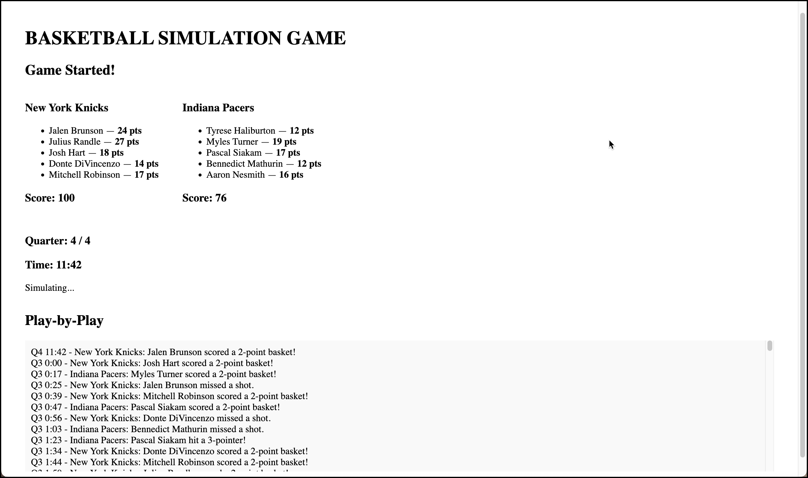

# 🏀 BASKETBALL SIMULATION APP

Basketball sim is a full-stack NBA game simulator built with the MERN stack (MongoDB, Express, React, Node.js). It simulates real-time basketball games using live player data and includes features like team selection, game controls, live play-by-play commentary, and historical game storage.

## 🌐 Live Features

- 🧠 **Real-Time Game Simulation** – 48-minute games using actual NBA player stats
- 🎮 **Interactive Controls** – Start, Pause, Stop, Timeout, Fast Forward
- 📊 **Live Play-by-Play Log** – Track actions as they happen
- 🧾 **Game History Tracking** – Stores previous games in MongoDB
- 🧑‍🤝‍🧑 **Team Selector** – Choose different NBA teams
- 📡 **Socket.IO Ready** – Optional real-time broadcasting support

## 🚀 Tech Stack

- **Frontend:** React, Tailwind (optional), JavaScript
- **Backend:** Node.js, Express, Mongoose
- **Database:** MongoDB (local or Atlas)
- **API:** NBA stats via [balldontlie.io](https://www.balldontlie.io/)

## 📁 Project Structure

```
project-root/
├── client/    # React frontend
├── server/    # Express backend
└── README.md
```

## ⚙️ Local Setup

### 1. Clone the Repo

```bash
git clone https://github.com/your-username/NBASIM_Project_Full.git
cd NBASIM_Project_Full
```

### 2. Start MongoDB (MACOS)

```bash
brew services start mongodb/brew/mongodb-community

```

### 3. Start Backend

```bash
cd server
npm install
npm start
```

### 4. Start Frontend

```bash
cd ../client
npm install
npm start
```

Visit [http://localhost:3000](http://localhost:3000)

---

## 🧪 API Endpoints

- `GET /api/games` – Get all saved games
- `POST /api/games/save` – Save a game result

---

## 🧠 Future Improvements

- WebSocket-powered live view
- ESPN-style GameCast layout
- Player performance graphs
- Multiplayer simulation mode

#---------------------------------------------------------------------
#-----------------------------------------------------------------------------

# Basketball Simulation Game

## Overview

This project simulates an NBA basketball game between two user-selected teams. Users pick 5 players from each team, and the game automatically simulates quarter-by-quarter (including overtime if needed), generates play-by-play commentary, box scores, and highlights hot/cold/star players.

---

## Major Changes

### 1. Team and Player Selection
- All 30 NBA teams are available.
- Each team has at least 12 players to choose from.
- Users select 5 players per team for the starting lineup.

### 2. Game Simulation
- The game simulates 4 quarters (12 minutes each).
- If the score is tied after 4 quarters, 5-minute overtime periods are automatically played until there is a winner.
- The simulation runs automatically—no need to click for each play.

### 3. Play-by-Play and Box Score
- Every play is logged in a play-by-play feed.
- Each player's points are tracked in a box score.
- At the end of the game, the "hot" (most points) and "cold" (fewest points) players for each team are highlighted.
- The overall star player (most points in the game) is displayed.

### 4. Accessibility
- All emoji indicators (hot, cold, star) are wrapped with `aria-label` and `role="img"` for accessibility.

---

## Removed Features

- Manual "Simulate Next Play" button (the game now runs automatically).
- Any code or UI for selecting fewer than 5 players per team.
- Any previous logic that did not support overtime or forced a tie.

---

## How to Use

1. **Select Team A and Team B** (cannot be the same team).
2. **Pick 5 players** for each team.
3. Click **Start Game**.
4. Watch the simulation, view the play-by-play, and see the final box score and star player.
5. If the game is tied after regulation, overtime(s) will be played until a winner is determined.

---

## File Changes

- `src/components/SelectTeam.jsx`: Updated to include 12 players per team.
- `src/App.jsx`: 
  - Added automatic simulation, overtime logic, play-by-play, box score, hot/cold/star player logic, and accessibility improvements.
  - Removed manual play simulation and tie endings.

---




## Future Improvements

- Add more player stats (rebounds, assists, etc.).
- Allow substitutions or bench management.
- Enhance play-by-play detail.

---

## 📄 License

MIT License

---

Built with ❤️ by [@zahyaa](https://github.com/zahyaa)
